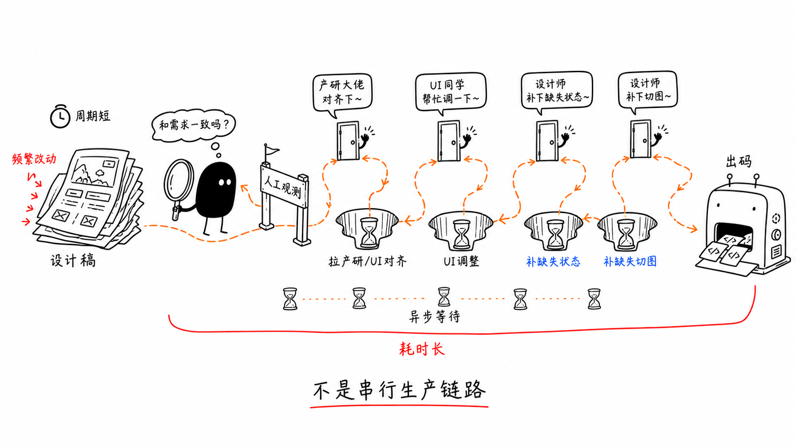
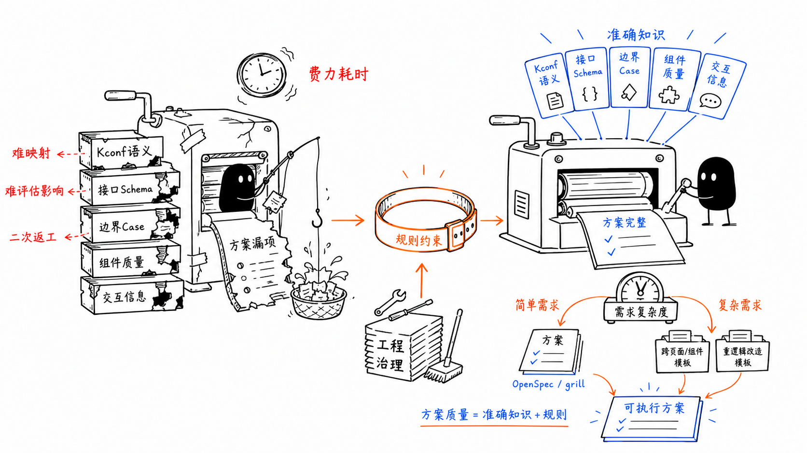
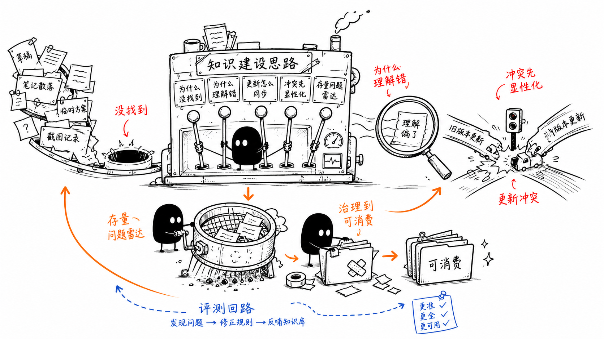

# 知识建设思路图

从散落笔记，到可消费知识库
当前问题：

下图用于记录 AI 工作流里的知识建设方法：先把散落材料收拢，再让问题显性化，最后通过评测回路持续治理到可消费状态。

## 建设主线

1. **先承认散落**：草稿、笔记、截图、临时方案如果没有统一入口，就会变成“没找到”。
2. **把失败原因变成开关**：每次没找到、理解错、同步失败、版本冲突，都要沉淀成可复用规则。
3. **冲突先显性化**：不要让旧版本和新版本在暗处互相覆盖，先标记来源、版本、适用范围。
4. **治理到可消费**：把存量问题通过清洗、合并、标注和索引，变成能被人和 Agent 直接使用的知识。
5. **保留评测回路**：持续观察是否更准、更全、更可用，用失败案例反向修正规则。

## 可执行清单

- 建一个统一入口，收拢散落笔记、草稿、截图和临时方案。
- 每条知识至少补齐：来源、更新时间、适用场景、失效条件。
- 对“没找到 / 理解错 / 版本冲突”建立单独的问题记录。
- 定期把问题记录反哺到索引、命名、标签和模板。
- 用真实任务评测知识库是否能被复用，而不是只看内容是否完整。

> 知识建设不是把内容堆多，而是让问题更早暴露、让规则持续更新、让结果可被消费。
